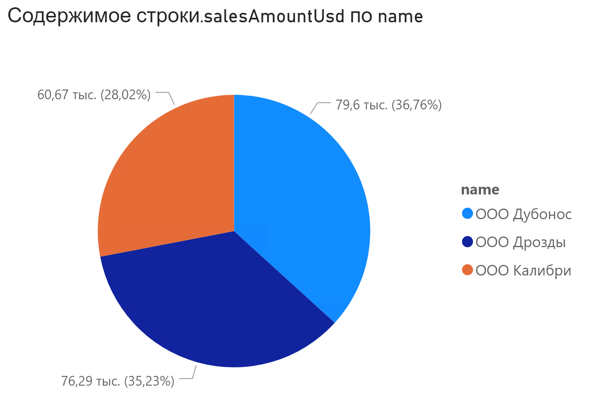
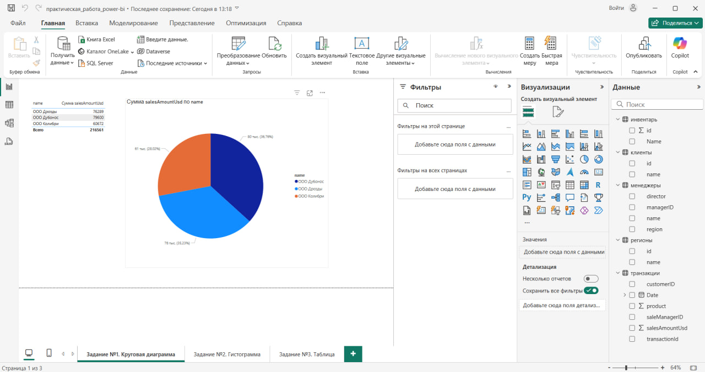
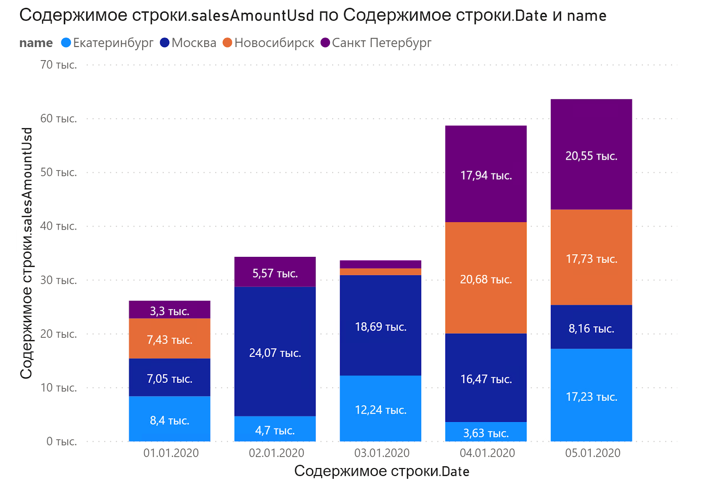
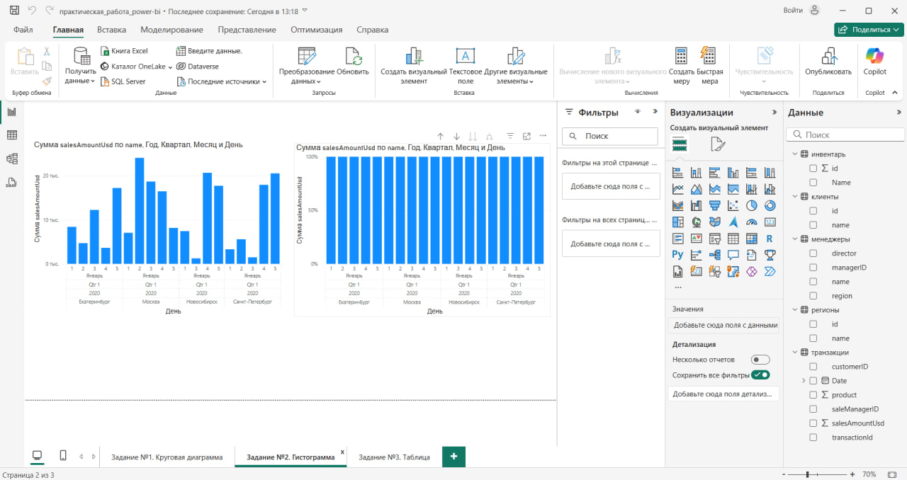
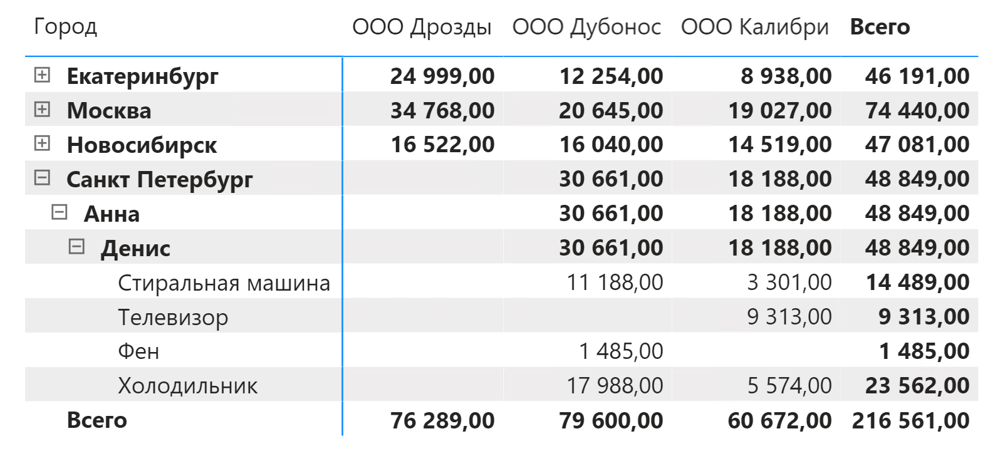
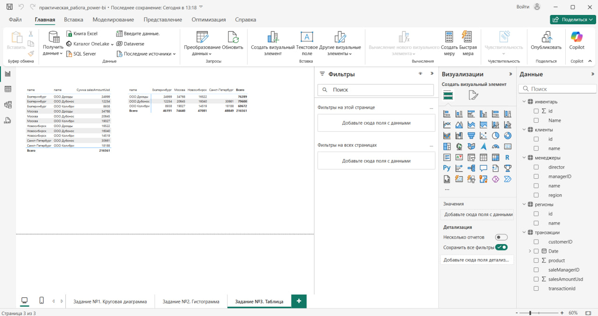

# Профессия Бизнес-аналитик 2024. Тариф Премиум

## Аналитик данных с нуля 2.0. Часть 2. Python, библиотеки NumPy и Pandas

## Содержание

1. [Калькулятор опыта](tasks/practical_work_7/01_experience_calculator.py)
2. [Функция](tasks/practical_work_7/02_function_task.py)
3. [Поступление](tasks/practical_work_7/03_admission_task.py)
4. [Опять двойка](tasks/practical_work_7/04_grade_task.py)
5. [Вася хочет выигрывать](tasks/practical_work_7/05_vasya_wants_to_win.py)
6. [Новоселье](tasks/practical_work_7/06_housewarming_task.py)
7. [Почта](tasks/practical_work_7/07_mail_task.py)

## Аналитик данных с нуля 2.0. Часть 3. SQL, чтение и запись данных, PowerBI

### Практическая работа 8.4: Анализ продаж в Power BI

### Цель задания

**Закрепить навыки работы с Power BI:**

- Загрузка и преобразование данных.
- Создание связей между таблицами.
- Построение модели «звезда».
- Визуализация данных с использованием диаграмм и матриц.

---

### Задание №1: Круговая диаграмма суммы продаж по клиентам



### Требования

Отобразить сумму продаж для каждого клиента за весь период.

**Итоговые значения:**
- ООО «Дрозды» — 76,6 тыс. `USD`
- ООО «Дубонос» — 79,29 тыс. `USD`
- ООО «Колибри» — 60,67 тыс. `USD`

### Шаги выполнения

1. **Добавьте таблицу клиентов:**
   - Создайте таблицу с соответствием `customerID` и названиями компаний:

     ```textline
     | customerID | Клиент          |
     |------------|-----------------|
     | 1.0        | ООО «Дрозды»    |
     | 2.0        | ООО «Дубонос»   |
     | 3.0        | ООО «Колибри»   |
     ```

2. **Установите связь:**
   - Свяжите основную таблицу продаж с таблицей клиентов по полю `customerID`.
3. **Постройте круговую диаграмму:**
   - **Ось:** Название компании.
   - **Значение:** `SUM(salesAmountUsd)`.
   - Проверьте соответствие итоговых сумм.

### Результат

Файл `.pbix` с диаграммой, где доли клиентов соответствуют указанным значениям.



### Задание №2: Гистограмма с накоплением по дням и городам





### Задание №3: Матрица с иерархией






## Структура репозитория

```bash
python-practice-work/
│
├── README.md                  # Основное описание проекта
├── requirements.txt           # Зависимости (если нужны)
│
├── tasks/                     # Директория с решениями задач
│   ├── practical_work_7
│   │   ├── 01_experience_calculator.py
│   │   ├── 02_function_task.py
│   │   ├── 03_admission_task.py
│   │   ├── 04_grade_task.py
│   │   ├── 05_vasya_wants_to_win.py
│   │   ├── 06_housewarming_task.py
│   │   └── 07_mail_task.py
│   │
│   └── practical_work_8.4
│       ├── data
│       │   ├── 8.4 Файл для практической работы.xlsx
│       │   ├── inventory table.xlsx
│       │   ├── region table.xlsx
│       │   ├── sales manager table.xlsx
│       │   └── сustomer table.xlsx
│       ├── img
│       │   ├── image-1.png
│       │   ├── image-2.png
│       │   ├── image-3.png
│       │   ├── image-4.png
│       │   ├── image-5.png
│       │   └── image-6.png
│       ├── README.md
│       ├── image-1.png
│       ├── image-1_final.png
│       ├── image-2.png
│       ├── image-2_final.png
│       ├── image-3.png
│       ├── image-3_final.png
│       └── практическая_работа_power-bi.pbix
│
├── tests/                     # Тесты для проверки решений
│   ├── test_experience.py
│   ├── test_function.py
│   └── ... (остальные тесты)
│
└── docs/                      # Документация
    ├── TASK_DESCRIPTIONS.md   # Подробные условия задач
    └── SOLUTION_NOTES.md      # Примечания по решениям
```

---

**Дата:** 14.04.2025

**Преподаватель:** Дуплей Максим Игоревич

**Cоциальные сети:**

- **TG:** `@dupley_maxim_1999`
- **TG:** `@quadd4rv1n7`
- **VK:** `@maestro7it`
