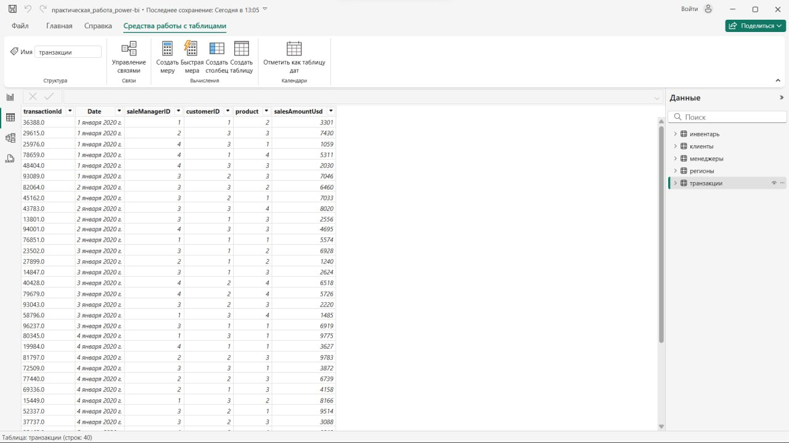

# Практическая работа 8.4: Анализ продаж в Power BI

## Цель задания

**Закрепить навыки работы с Power BI:**

- Загрузка и преобразование данных.
- Создание связей между таблицами.
- Построение модели «звезда».
- Визуализация данных с использованием диаграмм и матриц.

---

## Задание №1: Круговая диаграмма суммы продаж по клиентам


### Требования

Отобразить сумму продаж для каждого клиента за весь период.

**Итоговые значения:**
- ООО «Дрозды» — 76,6 тыс. `USD`
- ООО «Дубонос» — 79,29 тыс. `USD`
- ООО «Колибри» — 60,67 тыс. `USD`

### Шаги выполнения

1. **Добавьте таблицу клиентов:**
   - Создайте таблицу с соответствием `customerID` и названиями компаний:

     ```textline
     | customerID | Клиент          |
     |------------|-----------------|
     | 1.0        | ООО «Дрозды»    |
     | 2.0        | ООО «Дубонос»   |
     | 3.0        | ООО «Колибри»   |
     ```

2. **Установите связь:**
   - Свяжите основную таблицу продаж с таблицей клиентов по полю `customerID`.
3. **Постройте круговую диаграмму:**
   - **Ось:** Название компании.
   - **Значение:** `SUM(salesAmountUsd)`.
   - Проверьте соответствие итоговых сумм.

### Результат

Файл `.pbix` с диаграммой, где доли клиентов соответствуют указанным значениям.


---

## Задание №2: Гистограмма с накоплением по дням и городам


### Требования

Отобразить количество продаж по дням с разбивкой по городам.

### Шаги выполнения

1. **Добавьте таблицу городов:**
   - Свяжите `saleManagerID` с городами (пример):

     ```textline
     | saleManagerID | Город             |
     |---------------|-------------------|
     | 1.0           | Москва            |
     | 2.0           | Санкт-Петербург   |
     | 3.0           | Казань            |
     | 4.0           | Екатеринбург      |
     ```

2. **Установите связь:**
   - Свяжите таблицу продаж с таблицей городов.
3. **Постройте гистограмму:**
   - **Ось X:** Дата (формат: день).
   - **Легенда:** Город.
   - **Значение:** `COUNT(transactionId)`.

### Результат

Файл `.pbix` с гистограммой, где столбцы отображают продажи по дням с цветовой дифференциацией по городам.


---

## Задание №3: Матрица с иерархией


### Требования

**Создать матрицу:**
- **Столбец 1:** Города.
- **Столбцы 2–4:** Сумма продаж по клиентам.
- **Иерархия:** Город → Директор → Менеджер → Товар.
- Возможность детализации данных.

### Шаги выполнения

1. **Добавьте таблицы:**
   - Свяжите `saleManagerID` с директорами и менеджерами.
   - Свяжите `product` с названиями товаров (пример для товаров):

     ```textline
     | product | Товар        |
     |---------|--------------|
     | 1.0     | Ноутбук      |
     | 2.0     | Смартфон     |
     | 3.0     | Планшет      |
     | 4.0     | Монитор      |
     ```

2. **Настройте матрицу:**
   - **Строки:** Иерархия: Город → Директор → Менеджер → Товар.
   - **Столбцы:** Клиенты (ООО «Дрозды», ООО «Дубонос», ООО «Колибри»).
   - **Значения:** `SUM(salesAmountUsd)`.
3. **Включите детализацию:**
   - Разрешите раскрывать строки для просмотра данных по уровням иерархии.

### Результат

Файл `.pbix` с интерактивной матрицей, поддерживающей детализацию данных.


---

## Рекомендации

- Используйте **Power Query** для преобразования данных.
- Проверьте типы данных: даты должны быть в формате `Date`, суммы — `Currency`.
- Сохраняйте промежуточные результаты через **«Файл → Сохранить как»**.

---

## Сдача работы

1. Сохраните каждый этап в формате `.pbix`
2. Назовите файлы:  
   - `8.4_Задание1.pbix`
   - `8.4_Задание2.pbix`
   - `8.4_Задание3.pbix`
3. Отправьте файлы на проверку через платформу курса.

## Загрузка данных в Power BI




---

**Преподаватель:** Дуплей Максим Игоревич

**Cоциальные сети:**

- **TG:** `@dupley_maxim_1999`
- **TG:** `@quadd4rv1n7`
- **VK:** `@maestro7it`

**Дата:** 17.04.2025
